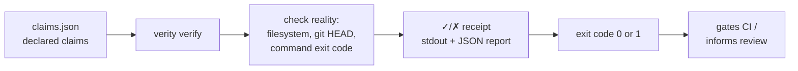
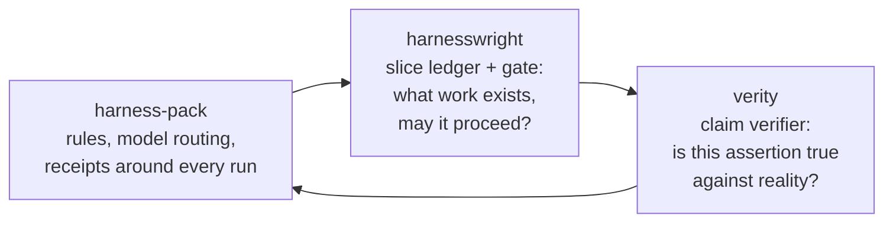

# verity

[](https://github.com/pietro-falco/verity/actions/workflows/ci.yml)

A notary for your coding agent's "done" — it checks a written claim against reality and stamps it true or false.

Status: alpha

## The problem, in plain words

Coding agents say "done" a lot. That word is a claim, not proof. verity
works like a notary: you don't ask it whether your document is *good*, you
hand it one specific written statement — "this file exists," "this test
exits 0," "this line is committed at `HEAD`" — and it checks that single
statement against reality and stamps it true or false. It doesn't read
intent, doesn't judge quality, doesn't call anyone for a second opinion.
Just the claim, the evidence, and a stamp — deterministic, offline, and
yours to inspect.

## How it works



## How it fits with its companions



## Commands

| Command | What it does |
| ------- | ------------- |
| `verity verify [manifestPath] [--json]` | Runs every claim in the manifest (default `.verity/claims.json`) against reality and prints a pass/fail summary; `--json` prints the full JSON report instead of the human summary |
| `verity --version` / `-v` | Prints the installed version |
| `verity --help` / `-h` | Prints usage |

## Guarantees and honest limits

- **Deterministic.** The same claims manifest against the same repository
  state always produces the same verdict — no LLM, no network call, in the
  loop.
- **Zero runtime dependencies.** Node.js built-ins only, so the whole
  checker is auditable in minutes.
- **Checks truth, not quality.** A passing claim means the assertion was
  true against reality — it says nothing about whether the code is good.
- **Doesn't sign or orchestrate.** Release artifacts on npm carry SLSA
  provenance (from v0.1.1); the receipts verity emits are not signed, and it
  orchestrates no workflows — see
  [`docs/adrs/0001-verity-architecture.md`](docs/adrs/0001-verity-architecture.md)
  for the boundary with adjacent tools.
- **Fails loud.** Exits `1` on any failed claim, so it composes with
  scripts and CI without extra glue.

## Install / Quickstart

The zero-install path — run it in any project with a `.verity/claims.json`
manifest:

```sh
cd your-repo            # anywhere with a .verity/claims.json
npx -y @pietro-falco/verity verify
```

**From source (for development):**

```
git clone https://github.com/pietro-falco/verity.git
cd verity
npm install
npm run build
node dist/cli.js verify
```

## Claim types

| type            | asserts                                   | key fields                          |
| ---------------- | ------------------------------------------ | ------------------------------------ |
| `file_exists`    | a path exists (optionally non-empty)      | `path`, `nonEmpty`                  |
| `file_matches`   | file content matches                      | `path`, `match`                     |
| `git_committed`  | path is committed at `HEAD`               | `path`, `match` (against committed content) |
| `command`        | a command's exit code / stdout            | `run`, `cwd`, `timeoutMs`, `expect` |

`match` is `{ kind: "substring" | "regex" | "sha256", value, flags? }`. Full
field-by-field semantics, defaults, and PASS conditions are in
[`docs/spec.md`](docs/spec.md).

## For coding agents

[`SKILL.md`](SKILL.md) is a cross-agent skill any coding agent can load. The
loop it describes: emit `.verity/claims.json` after finishing a task → run
`verity verify` → paste the full raw receipt back to the human, unedited.

## Scope and non-goals

verity does not judge semantic correctness (whether the code is *good*,
only whether the declared claim is *true*), does not sign anything in v0,
and does not orchestrate workflows. See
[`docs/adrs/0001-verity-architecture.md`](docs/adrs/0001-verity-architecture.md)
for the full reasoning. Where it sits relative to adjacent controls: rules
files request behavior; commit/CI hooks enforce process at commit time;
supply-chain attestation (SLSA/in-toto) covers release artifacts post-build;
verity reconciles task-level claims at review time — standalone, offline,
in the development loop itself.

## Design choices

- **Zero runtime dependencies.** Node built-ins only — the whole tool is
  auditable in minutes, with near-zero supply-chain surface.
- **Deterministic and offline.** No network calls, no LLM in the loop. Same
  inputs, same verdicts, every time.
- **In-toto-inspired vocabulary.** Receipts use `subject` / `predicate` /
  `evidence` / `verdict`, borrowed for interoperability with other
  evidence-consuming tooling.

## Verifying verity

This repository verifies itself: [`.verity/claims.json`](.verity/claims.json)
declares claims about verity's own README, license, ADR status, docs, and
test suite. Run it with:

```sh
node dist/cli.js verify
# or, against the published package:
npx -y @pietro-falco/verity verify
```

## License

MIT — see [`LICENSE`](LICENSE).
